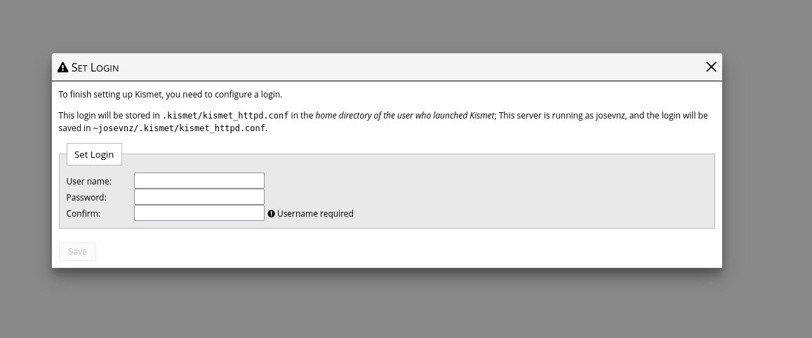
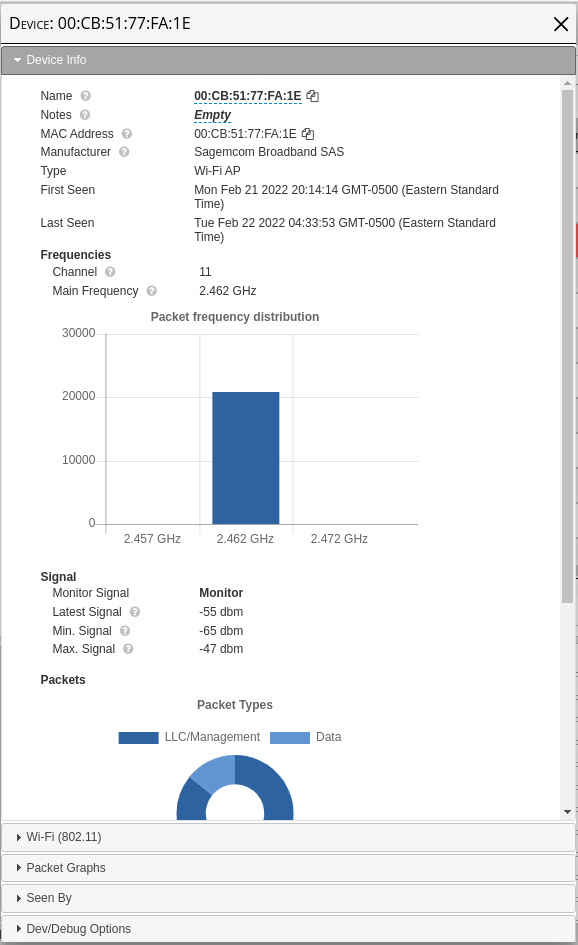
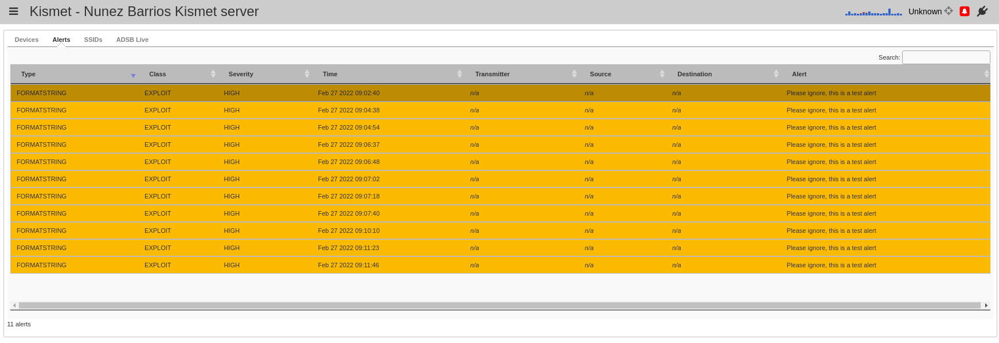
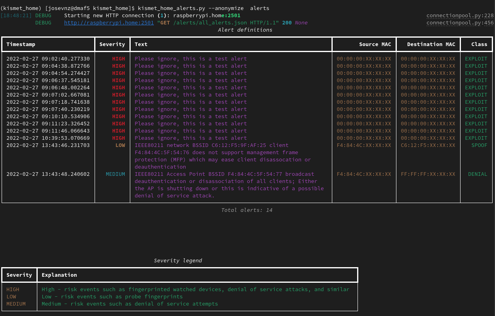

# Wireless security using Raspberry PI 4, Kismet and Python

Everything is connected to wireless these days; In my case I found that I have LOTS of devices after running a simple [nmap command on my home network](https://www.freecodecamp.org/news/enhance-nmap-with-python/#nmap-101-identify-all-the-public-services-in-our-network):

```shell
[josevnz@dmaf5 ~]$ sudo nmap -v -n -p- -sT -sV -O --osscan-limit --max-os-tries 1 -oX $HOME/home_scan.xml 192.168.1.0/24
```

So I started to wonder?
* Is my wireless network secure?
* How long would it take to an attacker to get in?

I have a Raspberry 4 with Ubuntu installed and decided to use the well-known [Aircrack-ng](https://aircrack-ng.org/index.html) to find out.

In this article you will learn:

* How to get a whole picture of the networks nearby you with Kismet
* How to customize Kismet using Python and the REST-API

# Note: The saying 'Ask for forgiveness, not permission' doesn't apply here

And by that I mean that you should not be trying to eavesdrop or infiltrate at wireless network that is not yours. It is relatively easy to detect if a new unknow client joined your wireless network, also it is illegal.

So do the right thing, use this tutorial to learn and not to break into someone else's network, OK?

# Getting to know your hardware

I will jump a little ahead to show you a small issue with the Raspberry 4 integrated Wireless interface.

__The Raspberry PI 4 onboard wireless card will not work out of the box as the firmware doesn't support monitor mode__

There are works to [support this](https://github.com/seemoo-lab/bcm-rpi3), but you are also risking bricking your hardware. Instead I took the easy way out and ordered an external Wifi dungle from [CanaKit](https://www.canakit.com/raspberry-pi-wifi.html).

The CanaKit wireless card worked out of the box, will see it shortly. But first let's install and play Kismet.

## Making sure the interface is running in monitor mode

By default, the network interface will have the monitor mode off:
```shell
root@raspberrypi:~# iwconfig wlan1
wlan1     IEEE 802.11  ESSID:off/any  
          Mode:Managed  Access Point: Not-Associated   Tx-Power=0 dBm   
          Retry short  long limit:2   RTS thr:off   Fragment thr:off
          Encryption key:off
          Power Management:off

```

I know I will always set up my 'Ralink Technology, Corp. RT5370 Wireless Adapter' adapter in monitor mode, but I need to be careful as Ubuntu can swap wlan0 and wlan1 (The Broadcom adapter I want to skip).

The _Ralink_ adapter is an usb adapter, so we can find out where it is:

```shell
josevnz@raspberrypi:/etc/netplan$ /bin/lsusb|grep Ralink
Bus 001 Device 004: ID 148f:5370 Ralink Technology, Corp. RT5370 Wireless Adapter
```

Now we need to find out what device was mapped to the Ralink adapter; With a little bit of help of the Ubuntu community I found than the Ralink adapter uses the *rt2800usb driver* [5370 Ralink Technology](https://help.ubuntu.com/community/WifiDocs/Device/Ralink_RT5370)

The answer I seek is here:

```shell
josevnz@raspberrypi:~$ ls /sys/bus/usb/drivers/rt2800usb/*:1.0/net/
wlan1
```

So my final script looks like this:

```shell
root@raspberrypi:~#/bin/cat<<RC_LOCAL>/etc/rc.local
#!/bin/bash
usb_driver=rt2800usb
wlan=\$(/bin/ls /sys/bus/usb/drivers/\$usb_driver/*/net/)
if [ $? -eq 0 ]; then
        set -ex
        /usr/sbin/ifconfig "\$wlan" down
        /usr/sbin/iwconfig "\$wlan" mode monitor
        /usr/sbin/ifconfig "\$wlan" up
        set +ex
fi
RC_LOCAL
root@raspberrypi:~# chmod u+x /etc/rc.local && shutdown -r now "Enabling monitor mode"
```

Make sure the card is on monitor mode:

```shell
root@raspberrypi:~# iwconfig wlan1
iw        iwconfig  iwevent   iwgetid   iwlist    iwpriv    iwspy     
root@raspberrypi:~# iwconfig wlan1
wlan1     IEEE 802.11  Mode:Monitor  Frequency:2.412 GHz  Tx-Power=20 dBm   
          Retry short  long limit:2   RTS thr:off   Fragment thr:off
          Power Management:off
```

Good, let's move on with the tool setup


# Kismet

[Kismet](https://www.kismetwireless.net/) is:

> Kismet is a wireless network and device detector, sniffer, wardriving tool, and WIDS (wireless intrusion detection) framework.

## Kismet installation and setup

The version that comes with the Ubuntu RaspberryPI by default is from 2016, *way too old*.

Instead, get an updated binary as [explained](https://www.kismetwireless.net/docs/readme/packages/) (I have Ubuntu focal, check with ```lsb_release --all```)

```shell
wget -O - https://www.kismetwireless.net/repos/kismet-release.gpg.key | sudo apt-key add -
echo 'deb https://www.kismetwireless.net/repos/apt/release/focal focal main' | sudo tee /etc/apt/sources.list.d/kismet.list
sudo apt update
sudo apt install kismet
```

Kismet need elevated privileges to run. And deals with possibly hostile data. So runing with minimized permissions is the safest approach. The right way to setup is by using a Unix group and suid binary. My user is 'josevnz' so I did this:

```shell=
sudo apt-get install kismet
sudo usermod --append --groups kismet josevnz
```


Then I overrode the default configuration with the following parameters:

### /etc/kismet/kismet_logging.conf

Save my logs to a SSD drive dedicated for this purpouse

```
logprefix=/data/kismet
```

### /etc/kismet/kismet_httpd.conf

I will enable SSL for my Kistmet [installation by using a self-signed certificate](https://github.com/josevnz/home_nmap/tree/main/tutorial). I will use for that the Cloudflare CFSSL tools:

```shell=
sudo apt-get update -y
sudo apt-get install -y golang-cfssl
```

Next step is to create the self-signed certificates. There is a lot of boilerplate steps here, so I will show you how you can jump through them (but please read the man pages to see what each command do):

#### Initial certificate
```shell
sudo /bin/mkdir --parents /etc/pki/raspberrypi
sudo /bin/cat<<CA>/etc/pki/raspberrypi/ca.json
{
   "CN": "Nunez Barrios family Root CA",
   "key": {
     "algo": "rsa",
     "size": 2048
   },
   "names": [
   {
     "C": "US",
     "L": "CT",
     "O": "Nunez Barrios",
     "OU": "Nunez Barrios Root CA",
     "ST": "United States"
   }
  ]
}
CA
cfssl gencert -initca ca.json | cfssljson -bare ca
```

#### SSL profile
```shell
root@raspberrypi:/etc/pki/raspberrypi# /bin/cat<<PROFILE>/etc/pki/raspberrypi/cfssl.json
{
   "signing": {
     "default": {
       "expiry": "17532h"
     },
     "profiles": {
       "intermediate_ca": {
         "usages": [
             "signing",
             "digital signature",
             "key encipherment",
             "cert sign",
             "crl sign",
             "server auth",
             "client auth"
         ],
         "expiry": "17532h",
         "ca_constraint": {
             "is_ca": true,
             "max_path_len": 0, 
             "max_path_len_zero": true
         }
       },
       "peer": {
         "usages": [
             "signing",
             "digital signature",
             "key encipherment", 
             "client auth",
             "server auth"
         ],
         "expiry": "17532h"
       },
       "server": {
         "usages": [
           "signing",
           "digital signing",
           "key encipherment",
           "server auth"
         ],
         "expiry": "17532h"
       },
       "client": {
         "usages": [
           "signing",
           "digital signature",
           "key encipherment", 
           "client auth"
         ],
         "expiry": "17532h"
       }
     }
   }
}
PROFILE
```

#### Intermediate certificate
```shell
root@raspberrypi:/etc/pki/raspberrypi# /bin/cat<<INTERMEDIATE>/etc/pki/raspberrypi/intermediate-ca.json
{
  "CN": "Barrios Nunez Intermediate CA",
  "key": {
    "algo": "rsa",
    "size": 2048
  },
  "names": [
    {
      "C":  "US",
      "L":  "CT",
      "O":  "Barrios Nunez",
      "OU": "Barrios Nunez Intermediate CA",
      "ST": "USA"
    }
  ],
  "ca": {
    "expiry": "43830h"
  }
}
INTERMEDIATE
cfssl gencert -initca intermediate-ca.json | cfssljson -bare intermediate_ca
cfssl sign -ca ca.pem -ca-key ca-key.pem -config cfssl.json -profile intermediate_ca intermediate_ca.csr | cfssljson -bare intermediate_ca
```

#### Configuration for the SSL certificate on the Raspberry PI 4 machine

Here we put the name and IP address of the machine that will run our Kismet web application:


```shell
/bin/cat<<RASPBERRYPI>/etc/pki/raspberrypi/raspberrypi.home.json
{
  "CN": "raspberrypi.home",
  "key": {
    "algo": "rsa",
    "size": 2048
  },
  "names": [
  {
    "C": "US",
    "L": "CT",
    "O": "Barrios Nunez",
    "OU": "Barrios Nunez Hosts",
    "ST": "USA"
  }
  ],
  "hosts": [
    "raspberrypi.home",
    "localhost",
    "raspberrypi",
    "192.168.1.11"
  ]               
}
RASPBERRYPI
cd /etc/pki/raspberrypi
cfssl gencert -ca intermediate_ca.pem -ca-key intermediate_ca-key.pem -config cfssl.json -profile=peer raspberrypi.home.json| cfssljson -bare raspberry-peer
cfssl gencert -ca intermediate_ca.pem -ca-key intermediate_ca-key.pem -config cfssl.json -profile=server raspberrypi.home.json| cfssljson -bare raspberry-server
cfssl gencert -ca intermediate_ca.pem -ca-key intermediate_ca-key.pem -config cfssl.json -profile=client raspberrypi.home.json| cfssljson -bare raspberry-client
```

Add SSL support to /etc/kismet/kismet_http.conf
```
/bin/cat<<SSL>>/etc/kismet/kismet_http.conf
httpd_ssl=true
httpd_ssl_cert=/etc/pki/raspberrypi/raspberry-server.csr
httpd_ssl_key=/etc/pki/raspberrypi/raspberry-server-key.pem
SSL
```

#### Kismet overrides file

Kismet has a really nice feature, it can use a file that override some of the defaults, without the need to edit multiple files. In this case My installation will override the SSL settings, Wifi interface and log location. So time to update our /etc/rc.local file:

```shell
#!/bin/bash
# Kismet setup
usb_driver=rt2800usb
wlan=$(ls /sys/bus/usb/drivers/$usb_driver/*/net/)
if [ $? -eq 0 ]; then
    set -ex
    /usr/sbin/ifconfig "$wlan" down
    /usr/sbin/iwconfig "$wlan" mode monitor
    /usr/sbin/ifconfig "$wlan" up
    set +ex
    /bin/cat<<KISMETOVERR>/etc/kismet/kismet_site.conf
server_name=Nunez Barrios Kismet server
source=$wlan
httpd_ssl=true
httpd_ssl_cert=/etc/pki/raspberrypi/raspberry-server.csr
httpd_ssl_key=/etc/pki/raspberrypi/raspberry-server-key.pem
KISMETOVERR
fi
```

Finally it is time to start kismet (in my case as the non root user josevnz):

```shell=
# If you know which interface is the one in monitoring mode, then 
josevnz@raspberrypi:~$ kismet
```
Now let's log for the first time on the web interface (In my case http://raspberripi.home:2501)




So the wireless devices around me look pretty normal,except one that doesn't have a name:




The web interface provides all sorts of useful information, but there is a easy way to filter all the mac addresses on my networks?

Kistmet has a REST API, so it is time to see what we can automate from there.

## REST-API

The [developer documentation](https://www.kismetwireless.net/docs/devel_group.html) contains examples of how to extend Kismet, specifically the one related to the [Kismet REST-API in Python](https://github.com/kismetwireless/python-kismet-rest).

But it seems to be missing a feature to use API keys, instead of user/password. And the interaction with the end points doesn't seem to be complicated so I will write my (less rich feature) wrapper.

You can download and install the code for a small application I wrote ([kismet_home](https://github.com/josevnz/kismet_home) to ilustrate how to work with Kismet (also has a copy of this tutorial) like this:

```shell
python3 -m venv ~/virtualenv/kismet_home
. ~/virtualenv/kismet_home/bin/activate
python -m pip install --upgrade pip
git clone git@github.com:josevnz/kismet_home.git
python setup.py bdist_wheel
pip install kismet_home-0.0.1-py3-none-any.whl
```

And then run the unit tests/ integration tests and even the third party vulnerability scanner:

```shell
. ~/virtualenv/kismet_home/bin/activate
pip-audit  --requirement requirements.txt
python -m unittest test/unit_test_config.py
python -m unittest /home/josevnz/kismet_home/test/test_integration_kismet.py
```

More details on the [README.md]() and [DEVELOPER.md]() files.

Let's move on with the code.

### Supporting code to interact with Kismet using Python

At first write a generic http client I can use to query or send commands to Kismet, that is the KismetWorker class:

```python
import json
from datetime import datetime
from typing import Any, Dict, Set, List, Union
import requests


class KismetBase:

    def __init__(self, *, api_key: str, url: str):
        """
        Parametric constructor
        :param api_key: The Kismet generated API key
        :param url: URL where the Kismet server is running
        """
        self.api_key = api_key
        if url[-1] != '/':
            self.url = f"{url}/"
        else:
            self.url = url
        self.cookies = {'KISMET': self.api_key}

    def __str__(self):
        return f"url={self.url}, api_key=XXX"

class KismetWorker(KismetBase):

    def check_session(self) -> None:
        """
        Confirm if the session is valid for a given API key
        :return: None, throws an exception if the session is invalid
        """
        endpoint = f"{self.url}session/check_session"
        r = requests.get(endpoint, cookies=self.cookies)
        r.raise_for_status()

    def check_system_status(self) -> Dict[str, Any]:
        """
        Overall status of the Kismet server
        :return: Nested dictionary describing different aspect of the Kismet system
        """
        endpoint = f"{self.url}system/status.json"
        r = requests.get(endpoint, cookies=self.cookies)
        r.raise_for_status()
        return json.loads(r.text)

    def get_all_alerts(self) -> Any:
        """
        You can get a description how the alert system is set up as shown here: /alerts/definitions.prettyjson
        This method returns the last N alerts registered by the system. Severity and meaning of the alert is explained
        here: https://www.kismetwireless.net/docs/devel/webui_rest/alerts/
        :return:
        """
        endpoint = f"{self.url}alerts/all_alerts.json"
        r = requests.get(endpoint, cookies=self.cookies)
        r.raise_for_status()
        return json.loads(r.text)

    def get_alert_by_hash(self, identifier: str) -> Dict[str, Any]:
        """
        Get details of a single alert by its identifier (hash)
        :return:
        """
        parsed = int(identifier)
        if parsed < 0:
            raise ValueError(f"Invalid ID provided: {identifier}")
        endpoint = f"{self.url}alerts/by-id/{identifier}/alert.json"
        r = requests.get(endpoint, cookies=self.cookies)
        r.raise_for_status()
        return json.loads(r.text)

    def get_alert_definitions(self) -> Dict[Union[str, int], Any]:
        """
        Get the defined alert types
        :return:
        """
        endpoint = f"{self.url}alerts/definitions.json"
        r = requests.get(endpoint, cookies=self.cookies)
        r.raise_for_status()
        return json.loads(r.text)
```

The way Kismet API works is that you make the API KEY part of the query or you define it in the KISMET cookie, I chosse to populate the cookie.

Implemented the following methods:

* **check_session**: It checks if your API KEY is valid. If not it will throw an exception
* **check_system_status**: Validates if the administrator (you most likely) defined an administrator for the Kismet server. If not, then all the API queries will fail
* **get_all_alerts**: Get all the available alerts (if any) from your Kismet server.
* **get_alert_by_hash**: If you know the identifier (hash) of an alert, you can retrieve the details of that event only
* **get_alert_definitions**: Get all the alert definitions. Kismet supports a wide range of alerts and an user will definitely be interested to find out what type of alerts they are

You can see [all the integration code]() here to see how the methods work in action.

Also wrote a class that requires admin privileges; I use it to define a custom alert type and to send alerts of that type to kismet, as part of the integration tests. Right now I don't have much use of sending custom alerts to Kismet in real life but that may change in the future, so here is the code:

```python
class KismetAdmin(KismetBase):

    def define_alert(
            self,
            *,
            name: str,
            description: str,
            throttle: str = '10/min',
            burst: str = "1/sec",
            severity: int = 5,
            aclass: str = 'SYSTEM'

    ):
        """
        Define a new type of alert for Kismet
        :param aclass: Alert class
        :param severity: Alert severity
        :param throttle: Optional throttle
        :param name: Name of the new alert
        :param description: What does this mean
        :param burst: Optional burst
        :return:
        """
        endpoint = f"{self.url}alerts/definitions/define_alert.cmd"
        command = {
            'name': name,
            'description': description,
            'throttle': throttle,
            'burst': burst,
            'severity': severity,
            'class': aclass
        }
        r = requests.post(endpoint, json=command, cookies=self.cookies)
        r.raise_for_status()

    def raise_alert(
            self,
            *,
            name: str,
            message: str
    ) -> None:
        """
        Send an alert to Kismet
        :param name: A well-defined name or id for the alert. MUST exist
        :param message: Message to send
        :return: None. Will raise an error if the alert could not be sent
        """
        endpoint = f"{self.url}alerts/raise_alerts.cmd"
        command = {
            'name': name,
            'text': message
        }
        r = requests.post(endpoint, json=command, cookies=self.cookies)
        r.raise_for_status()
```

Getting the data is just part of the story; We need to normalize it so it can be used by the final scripts.

### Normalizing the Kismet raw data

Kismet contains a lot of details about the alerts, but we do not require to show the user those details (think about the nice view you get with the web application); Instead we do a few transformations using the following class with static methods:

* **parse_alert_definitions**: Returns a simplified report of all the alert definitions
* **process_alerts**: Changes numeric alerts for more descriptive types and also returns dictionaries for the types and severity meaning of those alerts.
* **pretty_timestamp**: Convert the numeric timestamp into something we can use for comparisons and display

Look the code:

```python
class KismetResultsParser:
    SEVERITY = {
        0: {
            'name': 'INFO',
            'description': 'Informational alerts, such as datasource  errors, Kismet state changes, etc'
        },
        5: {
            'name': 'LOW',
            'description': 'Low - risk events such as probe fingerprints'
        },
        10: {
            'name': 'MEDIUM',
            'description': 'Medium - risk events such as denial of service attempts'
        },
        15: {
            'name': 'HIGH',
            'description': 'High - risk events such as fingerprinted watched devices, denial of service attacks, '
                           'and similar '
        },
        20: {
            'name': 'CRITICAL',
            'description': 'Critical errors such as fingerprinted known exploits'
        }
    }

    TYPES = {
        'DENIAL': 'Possible denial of service attack',
        'EXPLOIT': 'Known fingerprinted exploit attempt against a vulnerability',
        'OTHER': 'General category for alerts which don’t fit in any existing bucket',
        'PROBE': 'Probe by known tools',
        'SPOOF': 'Attempt to spoof an existing device',
        'SYSTEM': 'System events, such as log changes, datasource errors, etc.'
    }

    @staticmethod
    def parse_alert_definitions(
            *,
            alert_definitions: List[Dict[str, str]],
            keys_of_interest: Set[str] = None
    ) -> List[Dict[str, str]]:
        """
        Remove unwanted keys from full alert definition dump, to make it easier to read onscreen
        :param alert_definitions: Original Kismet alert definitions
        :param keys_of_interest: Kismet keys of interest
        :return: List of dictionaries with trimmed keys, description, severity and header for easy reading
        """
        if keys_of_interest is None:
            keys_of_interest = {
                'kismet.alert.definition.class',
                'kismet.alert.definition.description',
                'kismet.alert.definition.severity',
                'kismet.alert.definition.header'
            }
        parsed_alerts: List[Dict[str, str]] = []
        for definition in alert_definitions:
            new_definition = {}
            for def_key in definition:
                if def_key in keys_of_interest:
                    new_key = def_key.split('.')[-1]
                    new_definition[new_key] = definition[def_key]
            parsed_alerts.append(new_definition)
        return parsed_alerts

    @staticmethod
    def process_alerts(
            *,
            alerts: List[Dict[str, Union[str, int]]],

    ) -> Any:
        """
        Removed unwanted fields from alert details, also return extra data for severity and types of alerts
        :param alerts:
        :return:
        """
        processed_alerts = []
        found_types = {}
        found_severities = {}
        for alert in alerts:
            severity = alert['kismet.alert.severity']
            severity_name = KismetResultsParser.SEVERITY[severity]['name']
            severity_desc = KismetResultsParser.SEVERITY[severity]['description']
            found_severities[severity_name] = severity_desc
            text = alert['kismet.alert.text']
            aclass = alert['kismet.alert.class']
            found_types[aclass] = KismetResultsParser.TYPES[aclass]
            processed_alert = {
                'text': text,
                'class': aclass,
                'severity': severity_name,
                'hash': alert['kismet.alert.hash'],
                'dest_mac': alert['kismet.alert.dest_mac'],
                'source_mac': alert['kismet.alert.source_mac'],
                'timestamp': alert['kismet.alert.timestamp']
            }
            processed_alerts.append(processed_alert)
        return processed_alerts, found_severities, found_types

    @staticmethod
    def pretty_timestamp(timestamp: float) -> datetime:
        """
        Convert a Kismet timestamp (TIMESTAMP.UTIMESTAMP) into a pretty timestamp string
        :param timestamp:
        :return:
        """
        return datetime.fromtimestamp(timestamp)
```

If you run the integration tests with the admin role enabled, you will see than one or more (depending how many times you ran the test) alerts were added to the Web UI:




As a reminder, you can see how this is used by looking at the code [here](); Showing a sample run of all the integration tests against my installation:

```shell
(kismet_home) [josevnz@dmaf5 kismet_home]$ python -m unittest /home/josevnz/kismet_home/test/test_integration_kismet.py 
[09:13:05] DEBUG    Starting new HTTP connection (1): raspberrypi.home:2501                                                                                                                                                        connectionpool.py:228
           DEBUG    http://raspberrypi.home:2501 "GET /session/check_session HTTP/1.1" 200 None                                                                                                                                    connectionpool.py:456
.           DEBUG    Starting new HTTP connection (1): raspberrypi.home:2501                                                                                                                                                        connectionpool.py:228
           DEBUG    http://raspberrypi.home:2501 "GET /system/status.json HTTP/1.1" 200 None                                                                                                                                       connectionpool.py:456
.           DEBUG    Starting new HTTP connection (1): raspberrypi.home:2501                                                                                                                                                        connectionpool.py:228
           DEBUG    http://raspberrypi.home:2501 "GET /alerts/definitions.json HTTP/1.1" 200 None                                                                                                                                  connectionpool.py:456
.[09:13:05] 'ADMIN_SESSION_API' environment variable not defined. Skipping this test                                                                                                                                       test_integration_kismet.py:105
....
----------------------------------------------------------------------
Ran 7 tests in 0.053s

OK

```

### Where do we store our API key and other configuration details?

Details like this won't be hardcoded inside the scripts, but instead they will reside on a external configuration file:

```shell
(kismet_home) [josevnz@dmaf5 kismet_home]$ cat ~/.config/kodegeek/kismet_home/config.ini 
[server]
url = http://raspberrypi.home:2501
api_key = E41CAD466552810392D538FF8D43E2C5
```

The following class to handles all the access details (using a Reader and a Writer class for each type of operation):
```python
"""
Simple configuration management for kismet_home settings
"""
import os.path
from configparser import ConfigParser
from pathlib import Path
from typing import Dict

from kismet_home import CONSOLE

DEFAULT_INI = os.path.expanduser('~/.config/kodegeek/kismet_home/config.ini')
VALID_KEYS = {'api_key', 'url'}


class Reader:

    def __init__(self, config_file: str = DEFAULT_INI):
        """
        Constructor
        :param config_file: Optional override of the ini configuration file
        """
        self.config = ConfigParser()
        if not self.config.read(config_file):
            raise ValueError(f"Could not read {config_file}")

    def get_api_key(self):
        """
        Get back the API key used to connect to Kismet
        :return:
        """
        return self.config.get('server', 'api_key')

    def get_url(self):
        """
        Get back URL of Kismet server
        :return:
        """
        return self.config.get('server', 'url')


class Writer:

    def __init__(
            self,
            *,
            server_keys: Dict[str, str]
    ):
        if not server_keys:
            raise ValueError("Configuration is incomplete!, aborting!")
        self.config = ConfigParser()
        self.config.add_section('server')
        valid_keys_cnt = 0
        for key in server_keys:
            value = server_keys[key]
            if key not in VALID_KEYS:
                CONSOLE.log(f"Ignoring invalid key: {key} = {value}")
                continue
            self.config.set('server', key, value)
            CONSOLE.log(f"Added: server: {key} = {value}")
        for valid_key in VALID_KEYS:
            if not self.config.get('server', valid_key):
                raise ValueError(f"Missing required key: {valid_key}")

    def save(
            self,
            *,
            config_file: str = DEFAULT_INI
    ):
        basedir = Path(config_file).parent
        basedir.mkdir(exist_ok=True, parents=True)
        with open(config_file, 'w') as config:
            self.config.write(config, space_around_delimiters=True)
        CONSOLE.log(f"Configuration file {config_file} written")
```

The first time you set up your kismet_home installation, you can create the configuration files like this:
```shell
[josevnz@dmaf5 kismet_home]$ python3 -m venv ~/virtualenv/kismet_home
[josevnz@dmaf5 kismet_home]$ . ~/virtualenv/kismet_home/bin/activate
(kismet_home) [josevnz@dmaf5 kismet_home]$ python -m pip install --upgrade pip
(kismet_home) [josevnz@dmaf5 kismet_home]$ git clone git@github.com:josevnz/kismet_home.git
(kismet_home) [josevnz@dmaf5 kismet_home]$ python setup.py bdist_wheel
(kismet_home) [josevnz@dmaf5 kismet_home]$ pip install kismet_home-0.0.1-py3-none-any.whl

(kismet_home) [josevnz@dmaf5 kismet_home]$ kismet_home_config.py 
Please enter the URL of your Kismet server: http://raspberrypi.home:2501/
Please enter your API key: E41CAD466552810392D538FF8D43E2C5
[13:02:35] Added: server: url = http://raspberrypi.home:2501/                                                                                 config.py:44
           Added: server: api_key = E41CAD466552810392D538FF8D43E2C5                                                                          config.py:44
           Configuration file /home/josevnz/.config/kodegeek/kismet_home/config.ini written
```

Please note the use of the virtual environment here, this will allow to keep this application libraries self contained.


## Putting everything together: Writing our CLI for kismet_home

The kismet_home_alerts.py script will support two modes:
* Show the alert definitions
* Show all the alerts

Also, will allow filtering alerts based on the level (INFO, MEDIUM, HIGH, ...)

Showing all the definitions, filtered by CRITICAL:


Or showing all the alerts received so far, with anonymous MAC address (great for screenshots like this):



How you can generate this tables with ease? There is a dedicated class for the text user interface (TUI):

```python
from typing import List, Dict, Any

from rich.layout import Layout
from rich.table import Table

from kismet_home.kismet import KismetResultsParser


def create_alert_definition_table(
        *,
        alert_definitions: List[Dict[str, Any]],
        level_filter: str = 0
) -> Table:
    """
    Create a table showing the alert definitions
    :param alert_definitions: Alert definitions from Kismet
    :param level_filter: User can override the level of the alerts shown. But default is 0 (INFO)
    :return: A Table with the alert definitions
    """
    definition_table = Table(title="Alert definitions")
    definition_table.add_column("Severity", justify="right", style="cyan", no_wrap=True)
    definition_table.add_column("Description", style="magenta")
    definition_table.add_column("Header", justify="right", style="yellow")
    definition_table.add_column("Class", justify="right", style="green")
    filter_level = KismetResultsParser.get_level_for_security(level_filter)
    filtered_definitions = 0
    for definition in alert_definitions:
        int_severity: int = definition['severity']
        if int_severity < filter_level:
            continue
        severity = KismetResultsParser.SEVERITY[int_severity]['name']
        if 0 <= int_severity < 5:
            severity = f"[bold blue]{severity}[/ bold blue]"
        if 5 <= int_severity < 10:
            severity = f"[bold yellow]{severity}[/ bold yellow]"
        if 10 <= int_severity < 15:
            severity = f"[bold orange]{severity}[/ bold orange]"
        else:
            severity = f"[bold red]{severity}[/ bold red]"
        filtered_definitions += 1
        definition_table.add_row(
            severity,
            definition['description'],
            definition['header'],
            definition['class']
        )
    definition_table.caption = f"Total definitions: {filtered_definitions}"
    return definition_table


def create_alert_layout(
        *,
        alerts: List[Dict[str, Any]],
        level_filter: str = 0,
        anonymize: bool = False,
        severities: Dict[str, str]
):
    """
    :param severities:
    :param alerts:
    :param level_filter:
    :param anonymize:
    :return:
    """
    alerts_table = Table(title="Alert definitions")
    alerts_table.add_column("Timestamp", no_wrap=True)
    alerts_table.add_column("Severity", justify="right", style="cyan", no_wrap=True)
    alerts_table.add_column("Text", style="magenta")
    alerts_table.add_column("Source MAC", justify="right", style="yellow", no_wrap=True)
    alerts_table.add_column("Destination MAC", justify="right", style="yellow", no_wrap=True)
    alerts_table.add_column("Class", justify="right", style="green", no_wrap=True)
    filter_level = KismetResultsParser.get_level_for_security(level_filter)

    filtered_definitions = 0
    for alert in alerts:
        int_severity: int = KismetResultsParser.get_level_for_security(alert['severity'])
        if int_severity < filter_level:
            continue
        severity = KismetResultsParser.SEVERITY[int_severity]['name']
        if 0 <= int_severity < 5:
            severity = f"[bold blue]{severity}[/ bold blue]"
        if 5 <= int_severity < 10:
            severity = f"[bold yellow]{severity}[/ bold yellow]"
        if 10 <= int_severity < 15:
            severity = f"[bold orange]{severity}[/ bold orange]"
        else:
            severity = f"[bold red]{severity}[/ bold red]"
        filtered_definitions += 1
        if anonymize:
            s_mac = KismetResultsParser.anonymize_mac(alert['source_mac'])
            d_mac = KismetResultsParser.anonymize_mac(alert['dest_mac'])
        else:
            s_mac = alert['source_mac']
            d_mac = alert['dest_mac']
        alerts_table.add_row(
            str(KismetResultsParser.pretty_timestamp(alert['timestamp'])),
            severity,
            alert['text'],
            s_mac,
            d_mac,
            alert['class']
        )
    alerts_table.caption = f"Total alerts: {filtered_definitions}"

    severities_table = Table(title="Severity legend")
    severities_table.add_column("Severity")
    severities_table.add_column("Explanation")
    for severity in severities:
        explanation = f"[green]{severities[severity]}[/green]"
        severities_table.add_row(f"[yellow]{severity}[/yellow]", explanation)

    layout = Layout()
    layout.split(
        Layout(ratio=2, name="alerts"),
        Layout(name="severities"),
    )
    layout["alerts"].update(alerts_table)
    layout["severities"].update(severities_table)
    return layout, filtered_definitions
```

And now with all the ingredients ready we can see how the final script looks like:

```python
#!/usr/bin/env python
"""
# kismet_home_alerts.py
# Author
Jose Vicente Nunez Zuleta (kodegeek.com@protonmail.com)
"""
import logging
import sys

from requests import HTTPError
import argparse

from kismet_home import CONSOLE
from kismet_home.config import Reader
from kismet_home.kismet import KismetWorker, KismetResultsParser
from kismet_home.tui import create_alert_definition_table, create_alert_layout

if __name__ == '__main__':

    arg_parser = argparse.ArgumentParser(
        description="Display alerts generated by your local Kismet installation",
        prog=__file__
    )
    arg_parser.add_argument(
        '--debug',
        action='store_true',
        default=False,
        help="Enable debug mode"
    )
    arg_parser.add_argument(
        '--anonymize',
        action='store_true',
        default=False,
        help="Anonymize MAC addresses"
    )
    arg_parser.add_argument(
        '--level',
        action='store',
        default='INFO',
        help="Enable debug mode"
    )
    arg_parser.add_argument(
        'mode',
        action='store',
        choices=['alert_type', 'alerts'],
        help="Operation mode"
    )

    try:
        args = arg_parser.parse_args()
        conf_reader = Reader()
        kw = KismetWorker(
            api_key=conf_reader.get_api_key(),
            url=conf_reader.get_url()
        )
        if args.mode == 'alert_type':
            alert_definitions = KismetResultsParser.parse_alert_definitions(
                alert_definitions=kw.get_alert_definitions()
            )
            table = create_alert_definition_table(alert_definitions=alert_definitions, level_filter=args.level)
            if table.columns:
                CONSOLE.print(table)
            else:
                CONSOLE.print(f"[b]Could not get alert definitions![/b]")
        elif args.mode == 'alerts':
            alerts, severities, types = KismetResultsParser.process_alerts(
                alerts=kw.get_all_alerts()
            )
            layout, found = create_alert_layout(
                alerts=alerts,
                level_filter=args.level,
                anonymize=args.anonymize,
                severities=severities
            )
            if found:
                CONSOLE.print(layout)
            else:
                CONSOLE.print(f"[b]No alerts to show for level={args.level}[/b]")
    except (ValueError, HTTPError):
        logging.exception("There was an error")
        sys.exit(100)
    except KeyboardInterrupt:
        CONSOLE.log("Scan interrupted, exiting...")
    sys.exit(0)
```

A few things to note:
* This is not a long-running application. Instead, is a snapshot of all the alerts. If you wanted, for example to forward this alerts by email or to a framework like [grafana](https://grafana.com/), you are better off using [Websockets](https://pypi.org/project/websockets/) and one of the methods that retrieves only the last changes.
* The layout is crude, there is plenty of room for improvement. But our little tui is displaying relevant information without too many distractions
* And if was fun to code!

# What did we learn?

* How to install Kismet and secure it with a self-signed SSL certificate
* Wrote a simple Bash script to set up the correct Wireless interface in monitor mode, after the RaspBerryPI reboots.
* How to add an API KEY with read-only access to use it instead of the legacy user/ password schema for authentication and authorization
* Wrote a classes in Python that can communicate with Kismet using its REST-API
* Added unit and integration tests to the code to make sure everything works and new code changes do not break existing functionality

Please leave your comments on the [GitHub repository](https://github.com/josevnz/kismet_home) and report any bugs. But more important get Kismet, get the code and start securing your home wireless infrastructure in no time.